# OdontoPRO


O **OdontoPRO** é uma aplicação SaaS voltada para clínicas de saúde que desejam gerenciar seus atendimentos de forma moderna e eficiente. Com ele, é possível organizar agendamentos, configurar um perfil público para que pacientes possam marcar consultas online, gerenciar serviços oferecidos, dados da clínica e muito mais.

Desenvolvido com tecnologias modernas como _Next.js, Tailwind CSS e TypeScript_, o sistema conta com um painel administrativo completo, integração com _Stripe_ para cobrança de planos, autenticação segura via _NextAuth_ (login com Google), além de recursos de performance e acessibilidade com _React Query, clsx, shadcn/ui e date-fns_.

Toda a manipulação e persistência de dados é feita com _Prisma e Neon Postgres_, enquanto o _Cloudinary_ é utilizado para gerenciamento de imagens. O resultado é uma solução robusta, escalável e com excelente experiência para clínicas e pacientes.

## Sumário

1. [Visão Geral do Projeto](#visão-geral-do-projeto-funcionalidades-principais)
   - [Gerenciamento da clínica](#1-gerenciamento-da-clínica)
   - [Agendamento online](#2-agendamento-online)
   - [Gestão de serviços](#3-gestão-de-serviços)
   - [Planos e pagamentos](#4-planos-e-pagamentos)
   - [Dashboard e painel administrativo](#5-dashboard-e-painel-administrativo)
2. [Tecnologias Utilizadas](#tecnologias-utilizadas-linguagens-e-ferramentas)
3. [Estrutura do Projeto](#estrutura-do-projeto)
5. [Screenshots](#screenshots)
   - [Web](#web)
6. [Requisitos para Rodar o Projeto Localmente](#requisitos-para-rodar-o-projeto-localmente)
7. [Rodar o Projeto Localmente](#rodar-o-projeto-localmente)
8. [Autores](#autores)
9. [Licença](#licença)

## Visão Geral do Projeto (Funcionalidades Principais)

### 1. Gerenciamento da clínica:

- Cadastro e edição de informações da clínica (nome, endereço, contato, descrição etc.)

- Upload e gerenciamento de imagens via Cloudinary

- Gerenciamento de profissionais de saúde vinculados à clínica

### 2. Agendamento online:

- Página pública da clínica para que pacientes agendem consultas online

- Exibição de horários disponíveis em tempo real

### 3. Gestão de serviços:

- Criação e personalização de serviços oferecidos (valores, duração, descrição)

- Associação de serviços a profissionais específicos

- Ordenação e destaque de serviços no perfil público

### 4. Planos e pagamentos:

- Sistema de planos com cobrança recorrente via Stripe

- Controle de limites por plano (número de agendamentos, serviços ou profissionais)

- Painel administrativo para visualização e controle de assinaturas

### 5. Dashboard e painel administrativo:

- Visualização de agendamentos futuros e passados

- Acompanhamento e gerenciamento dos agendamentos em tempo real (futuramente expansível)

- Cadastro de lembretes para destacar alguma informação importante

## Tecnologias Utilizadas (Linguagens e ferramentas)

<table>
    <tr>
      <td align="center">
        <a href="https://nextjs.org/">
          
          <br />
          <sub>
            <b>Next.JS</b>
          </sub>
        </a>
      </td>
      <td align="center">
        <a href="https://tailwindcss.com/">
          
          <br />
          <sub>
            <b>Tailwind</b>
          </sub>
        </a>
      </td>
      <td align="center">
        <a href="https://www.typescriptlang.org/">
          
          <br />
          <sub>
            <b>TypeScript</b>
          </sub>
        </a>
      </td>
    </tr>
</table>
<table border-style="none">
  <tr>
    <td align="center">
      <a href="https://www.postgresql.org/">
        <br />
        <sub>
          <b>Postgres</b>
        </sub>
      </a>
    </td>
    <td align="center">
      <a href="https://www.prisma.io/?via=start&gad_source=1&gclid=CjwKCAiAh6y9BhBREiwApBLHC9l2TMrWhYJPi787DeRP5SCnQp6MnosFLDKIvTfWJ9IoUl684SdROhoCrTUQAvD_BwE">
        <br />
        <sub>
          <b>Prisma</b>
        </sub>
      </a>
    </td>
    <td align="center">
      <a href="https://cloudinary.com/">
        <br />
        <sub>
          <b>Cloudinary</b>
        </sub>
      </a>
    </td>
    <td align="center">
      <a href="https://neon.tech/">
        <br />
        <sub>
          <b>Neon-Postgres</b>
        </sub>
      </a>
    </td>
    <td align="center">
      <a href="https://git-scm.com/">
        <br />
        <sub>
          <b>Git</b>
        </sub>
      </a>
    </td>
  </tr>
</table>

## Estrutura do Projeto

O projeto é organizado em vários arquivos para melhor organização do código e separação de interesses:

- `src/app`: É a pasta responsável pelas páginas da aplicação;
- `src/components`: É a pasta responsável pela organização dos componentes globais da aplicação;
- `src/lib`: É a pasta responsável pela configuração de serviços externos usados no projeto;
- `src/providers`: É a pasta responsável pelo provider, que no caso, é o react-query utilizado na aplicação;
- `src/utils`: É a pasta responsável por funcionalidades úteis em todo o projeto;

## Screenshots

### Web

#### Home

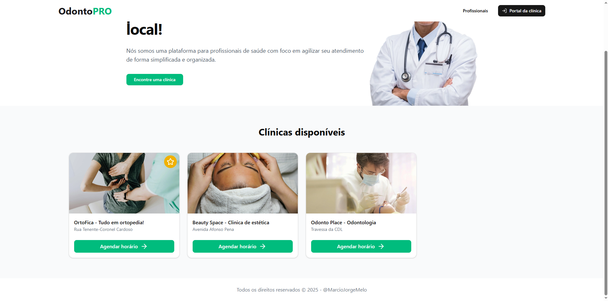
#### Agendamento - Cliente
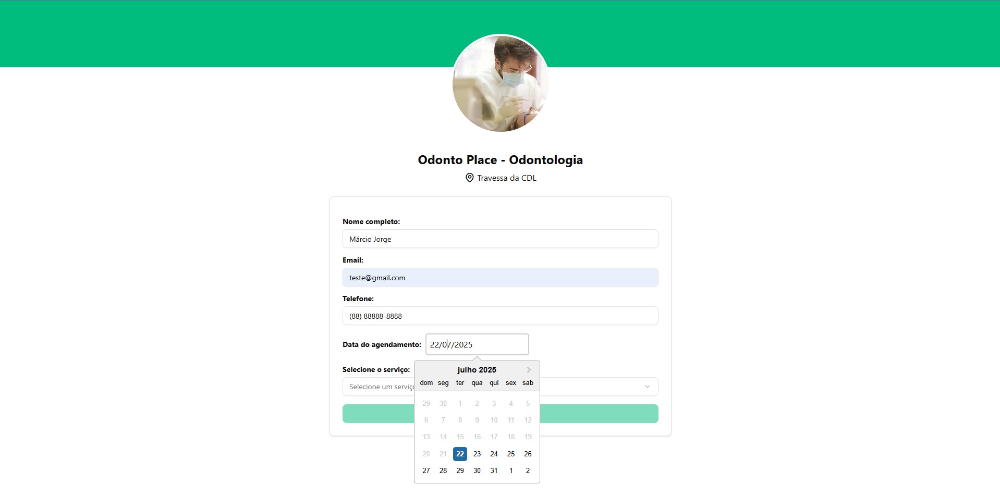
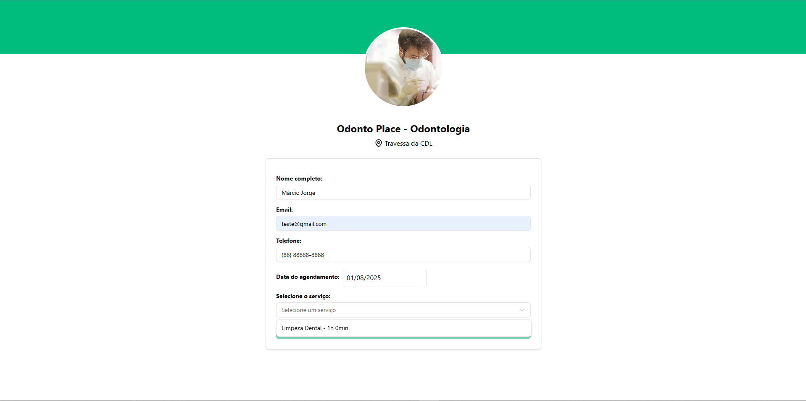
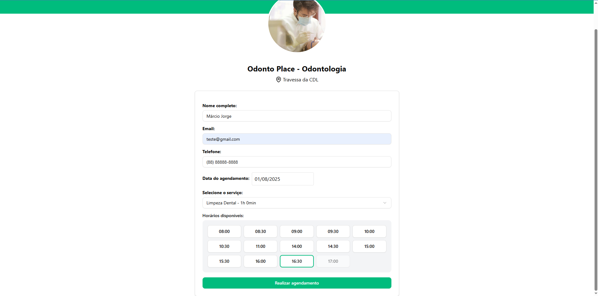
#### Dashboard
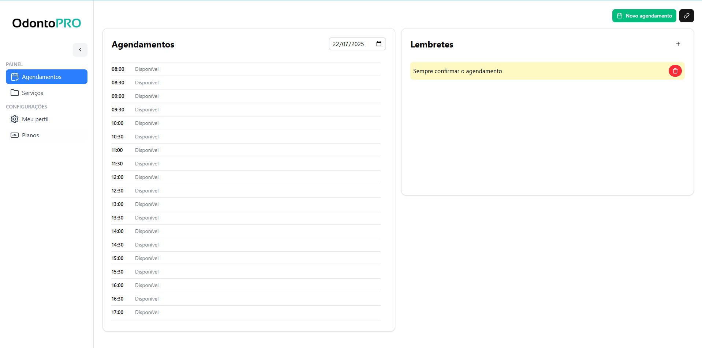
#### Agendamento - Gerenciamento
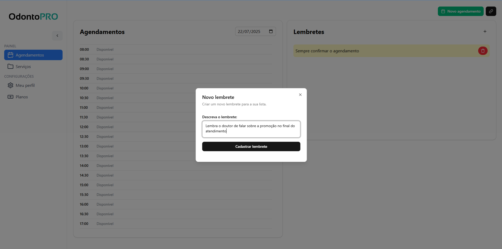
#### Serviços
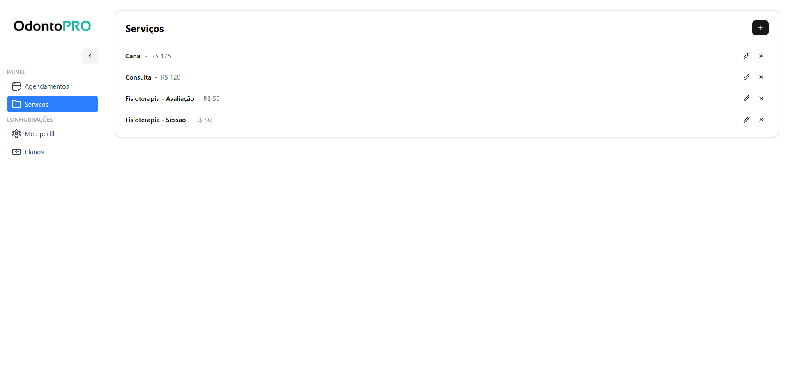
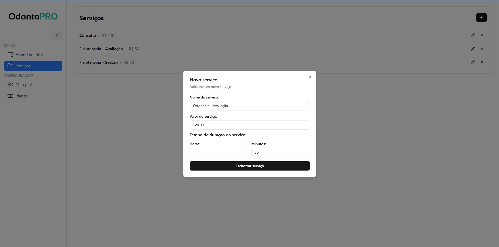
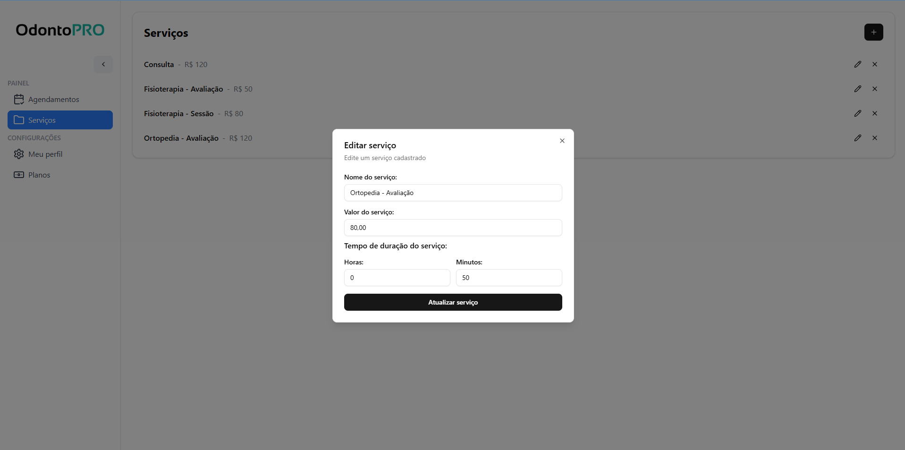
#### Perfil
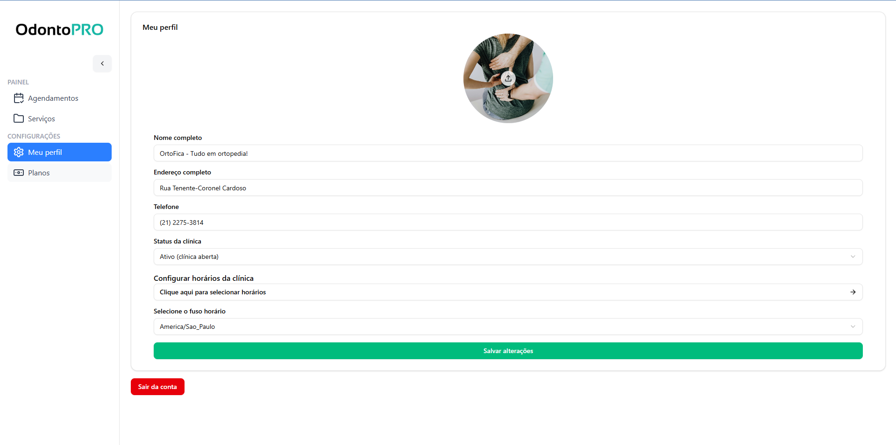
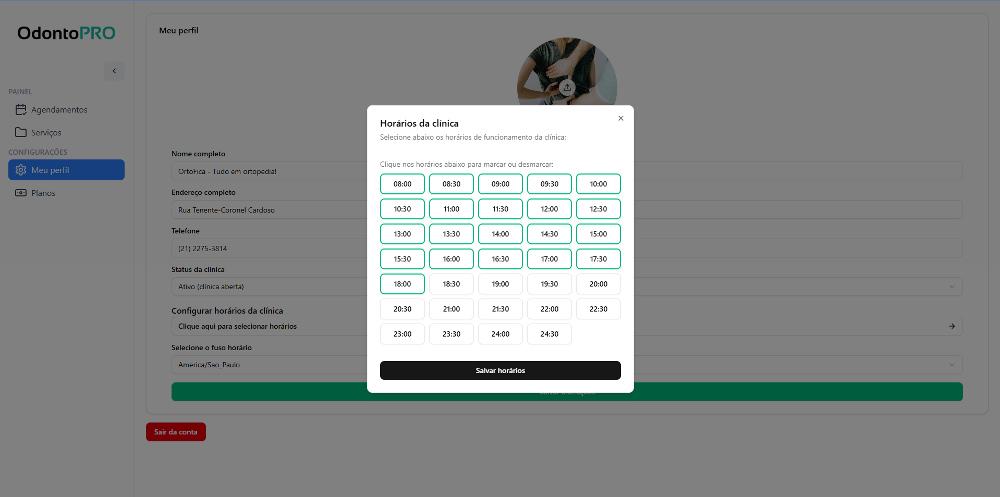
#### Planos
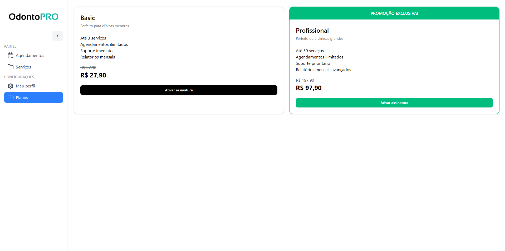
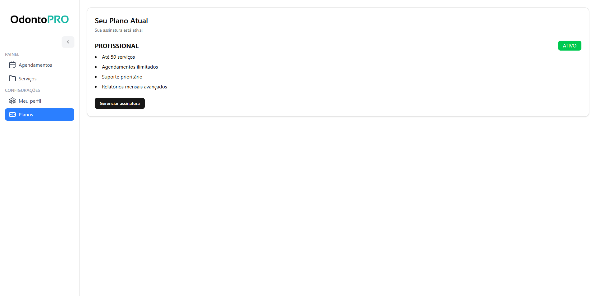

## Requisitos para Rodar o Projeto Localmente

### Node.js e npm:

- Verifique se você tem o Node.js instalado. Caso contrário, faça o download e instale a versão mais recente do Node.js.
- O npm (Node Package Manager) é instalado automaticamente com o Node.js.

### Git:

- Certifique-se de ter o Git instalado em sua máquina. Se não tiver, você pode baixá-lo aqui.

### Editor de Texto ou IDE:

- Escolha um editor de texto ou uma IDE (Ambiente de Desenvolvimento Integrado) para trabalhar no código. Alguns exemplos populares incluem o Visual Studio Code, Sublime Text e Atom.

### Navegador Web:

- Você precisará de um navegador web para visualizar o aplicativo localmente. Recomendamos o uso do Google Chrome, Mozilla Firefox ou Microsoft Edge.

### Configuração dos sistemas externos:

- Necessita realizar toda a configuração do Prisma, Postgres e Cloudinary.

## Rodar o Projeto Localmente

**Clone o projeto**

```bash
  git clone https://github.com/MarcioJorgeMelo/dev-restaurante.git
```

**Vá para a pasta do projeto**

```bash
  cd dev-restaurante
```

**Abra o projeto no VSCode**

```bash
  code .
```

**Instale as dependências**

```bash
  cd frontend
```

```bash
  npm install # Instala as dependências (se ainda não tiver feito)
```

**Rode os projetos**

```bash
  cd frontend
```

```bash
  npm run dev
```

## Autores

- [@MarcioJorgeMelo](https://github.com/MarcioJorgeMelo)

## Licença

- [MIT](https://choosealicense.com/licenses/mit/)
